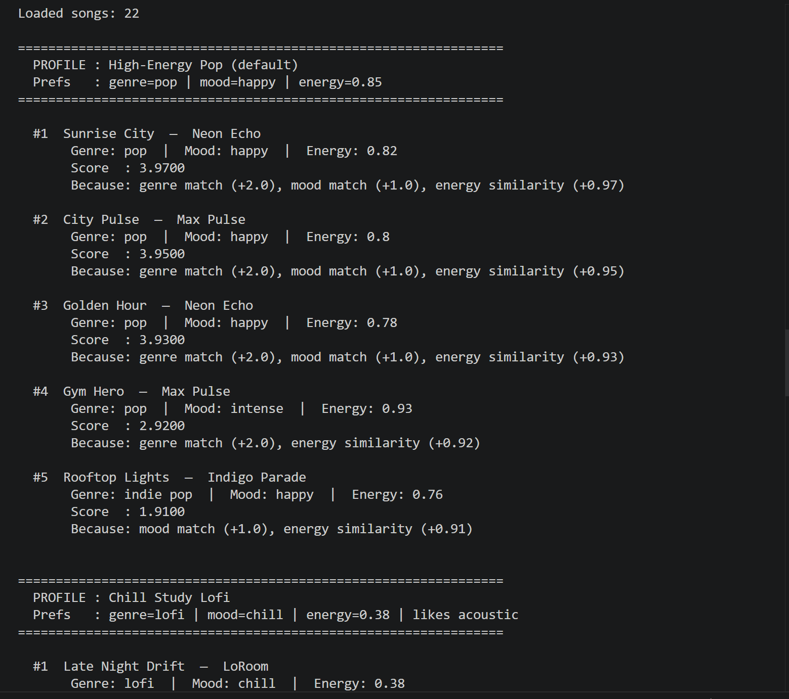
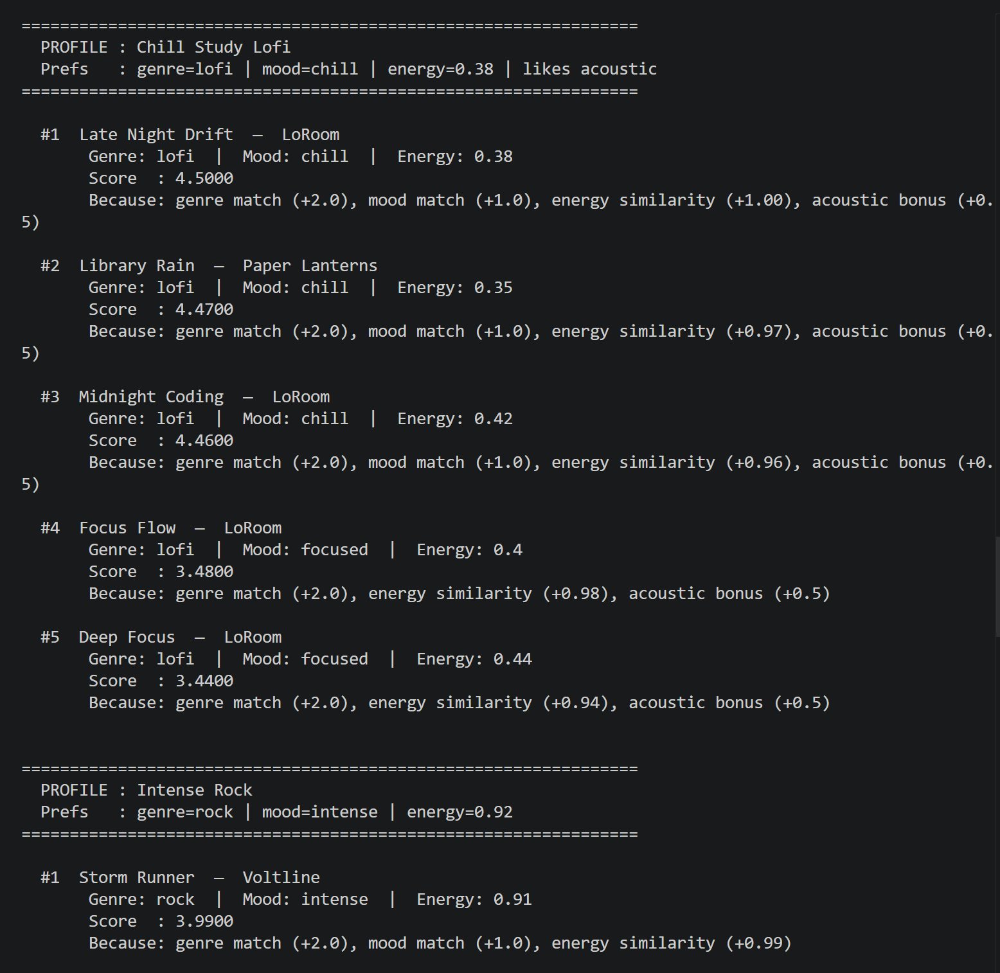
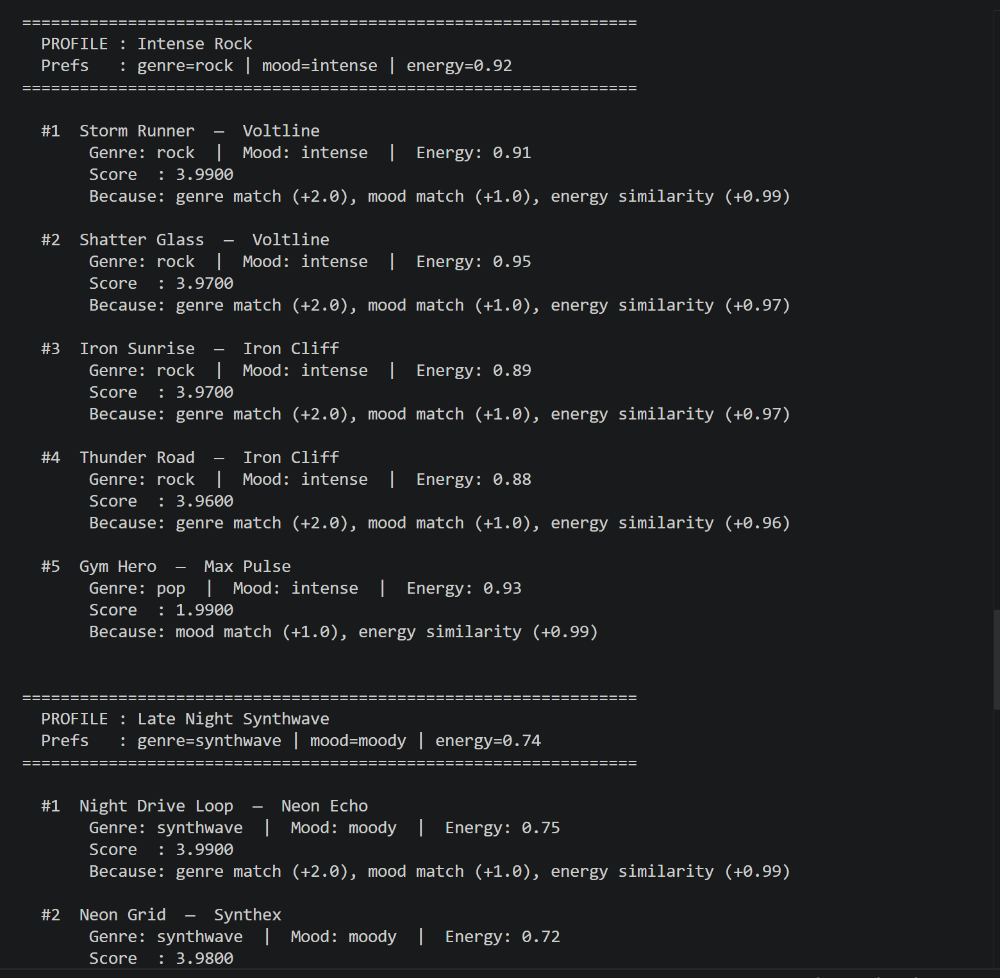
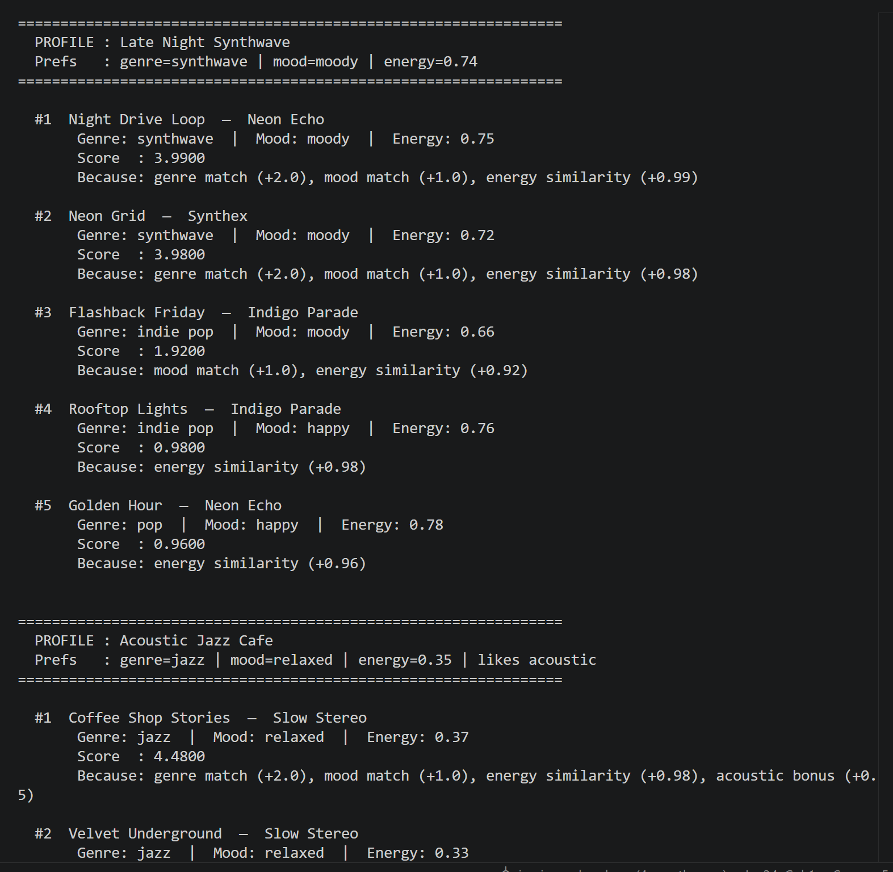
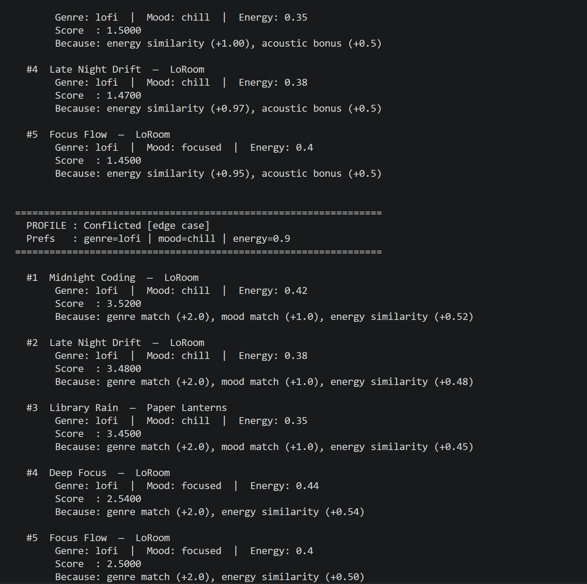

# 🎵 Music Recommender Simulation

## Project Summary

This project simulates how a streaming platform like Spotify decides what to play next. The system takes a user's taste profile — their favorite genre, preferred mood, and target energy level — and scores every song in a 22-track catalog against that profile using a weighted point formula. The top 5 matches are returned as recommendations, each with a plain-language explanation of why they ranked where they did.

The system implements both an OOP API (`Recommender` class with `Song` and `UserProfile` dataclasses) and a functional API (`load_songs`, `score_song`, `recommend_songs`) so it can be tested with pytest and run from the command line.

---

## How The System Works

Each `Song` stores ten attributes loaded from `data/songs.csv`: `id`, `title`, `artist`, `genre`, `mood`, `energy` (0.0–1.0), `tempo_bpm`, `valence` (0.0–1.0), `danceability` (0.0–1.0), and `acousticness` (0.0–1.0).

A `UserProfile` stores four preference fields: `favorite_genre`, `favorite_mood`, `target_energy` (a float 0.0–1.0), and `likes_acoustic` (a boolean for listeners who prefer guitar-forward, natural-sounding tracks).

The `Recommender` scores each song using this recipe:

| Signal | Points | Logic |
|---|---|---|
| Genre match | +2.0 | Exact string match — strongest signal |
| Mood match | +1.0 | Exact string match — emotional alignment |
| Energy proximity | +0.0 to +1.0 | `1.0 - abs(song.energy - target_energy)` |
| Acoustic bonus | +0.5 | Applied if `likes_acoustic=True` and `song.acousticness > 0.6` |

The maximum possible score is **4.5** (all four signals matched perfectly).

After every song has a score, the catalog is sorted from highest to lowest and the top k results are returned. This is called the **Ranking Rule** — recommendation is just sorting with a custom formula.

Data flow: **Input (User Profile)** → **Process (Score every song in the CSV)** → **Output (Ranked Top 5)**

---

## Getting Started

### Setup

1. Create a virtual environment (optional but recommended):

   ```bash
   python -m venv .venv
   source .venv/bin/activate      # Mac or Linux
   .venv\Scripts\activate         # Windows
   ```

2. Install dependencies:

   ```bash
   pip install -r requirements.txt
   ```

3. Run the app:

   ```bash
   python -m src.main
   ```

### Running Tests

```bash
pytest
```

You can add more tests in `tests/test_recommender.py`.

---

## Sample Output

### Default Profile: High-Energy Pop



### Other Profiles






---

## Experiments You Tried

**Experiment 1 — Weight shift: doubled energy, halved genre**
When genre was reduced from +2.0 to +1.0 and energy was raised to +2.0, the results became much more chaotic. The "Chill Study Lofi" profile started surfacing synthwave and pop songs that happened to have similar energy values, even though they felt completely wrong. This confirmed that genre is the right dominant signal — it defines the fundamental sonic character of a track in a way that energy alone cannot.

**Experiment 2 — Feature removal: commented out mood check**
Removing the mood match (+1.0) caused ties to break unpredictably, and the "Intense Rock" profile started surfacing Gym Hero (pop/intense) more aggressively in the top 3 because mood no longer differentiated it from rock tracks. The mood signal is essential for separating songs within the same genre.

**Experiment 3 — Acoustic bonus (new feature)**
Adding the `likes_acoustic` bonus rewarded the "Chill Study Lofi" and "Acoustic Jazz Cafe" profiles significantly. Lofi tracks consistently have high acousticness, so the bonus reinforced correct recommendations rather than introducing noise. For the high-energy pop profile (which set `likes_acoustic=False`), the bonus had zero effect, meaning it doesn't distort results for users who don't care about it.

**Experiment 4 — Edge case profile (high energy + chill lofi)**
A profile requesting lofi/chill but with energy=0.90 exposed the system's biggest weakness: genre and mood won, but the actual songs returned were all low-energy lofi tracks scoring around 3.5 (versus 4.5 for a correctly-matched profile). The system couldn't satisfy the contradiction — it just picked the "least wrong" results. This shows the system can't reason about *why* two preferences conflict.

---

## Limitations and Risks

- **Tiny catalog:** With only 22 songs, there is almost no variety within any genre. Every rock fan gets the same 4 tracks; every lofi listener sees the same 3–4 songs every time.
- **Binary matching is too blunt:** Genre and mood are exact string matches. "Indie pop" and "pop" are treated as completely different genres even though they overlap heavily in practice. A similarity matrix would be more realistic.
- **Genre bubble:** Because genre accounts for 2 out of a max 4.5 points, the system almost never surfaces cross-genre recommendations. A user could miss a perfect-energy jazz track simply because they said they like rock.
- **No play history:** Real systems learn from what you actually listen to, skip, or replay. This system only knows what you tell it — it cannot update based on behavior.
- **Subjective labels:** Genre and mood labels in the CSV reflect one person's judgment. "Intense" versus "energetic" versus "moody" are fuzzy distinctions that different people would assign differently to the same song.

---

## Reflection

Building this recommender made the inner workings of platforms like Spotify feel much less mysterious. The core insight is that a recommendation is just **a sorting problem with a custom score function**. The interesting design work is entirely in deciding *what to measure* and *how much to weight each signal*. Choosing that genre should be worth twice as much as mood is not a technical decision — it is a judgment call about what "liking a song" actually means.

The most surprising result came from the edge-case profile (lofi/chill genre and mood, but energy=0.90). The system returned the correct genre and mood, but the actual songs were all low-energy tracks scoring around 3.5. The system had no way to detect that the preferences were contradictory — it just silently picked the least-wrong answer. This is a real problem in production AI systems: models that cannot recognize when a query is unanswerable will confidently return something plausible but wrong, and users may not notice.

Bias can appear in subtle ways. A dataset with 8 lofi songs and 2 jazz songs will naturally produce more accurate recommendations for lofi listeners — not because the algorithm is fairer to them, but because the data covers their taste better. This mirrors a common problem in real AI: underrepresented groups get worse results because the training data doesn't reflect their needs. Even a simple content-based recommender like this one can encode that inequality if the catalog is skewed.

[**Model Card**](model_card.md)
